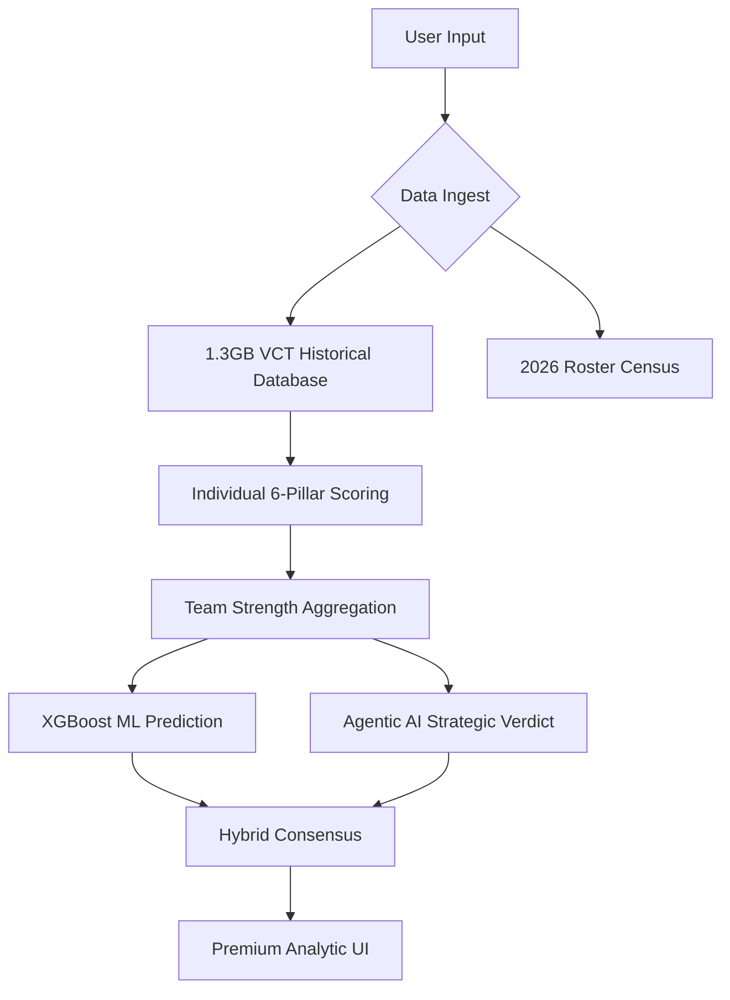

# 🎯 VALORANT AI Analytics Platform (Hybrid Agentic v1.0)
### Match Prediction, Roster Intelligence & 2026 Season Forecasting

[](https://github.com/DevanshX786/VALORANT-AI-Analytics-Platform)
[](https://github.com/DevanshX786/VALORANT-AI-Analytics-Platform)

> **🟢 CURRENT PROJECT STATUS**
> * **[✅ COMPLETED] Module 1 (Match Prediction Engine):** The data pipeline, historical XGBoost prediction engine, FastAPI backend, and dynamic Hybrid Agentic UI are fully implemented and operational.
> * **[🛠️ IN PROGRESS] Module 2 (Roster Transfer Impact):** Currently architecting the simulation engine to evaluate the performance swing of theoretical roster changes.

---

## 🧠 The Hybrid Agentic Innovation (v1.0)

Most esports models rely purely on historical statistics, which fail during **Roster Resets** or **Power Balance Shifts**. This platform introduces a **Hybrid Agentic Architecture** that combines raw Machine Learning with an AI Strategic Analyst layer.

### ⚖️ 50/50 Consensus Model
Every prediction is a consensus between:
1.  **XGBoost ML Engine:** Analyzes 1.3GB of historical VCT data (2021-2025) to identify numerical trends.
2.  **Agentic AI Analyst:** Evaluates high-level strategic factors like IGL leadership, roster-wide mechanical potential, and chemistry.

### 🛡️ 2026 Season Neutrality
To prevent "Brand Bias" (e.g., Fnatic winning just because they are Fnatic), the system enforces a **Season Reset**. Teams must prove their worth based on their *current* 5-man core potential rather than legacy trophies.

---

## 🚀 Modules

### 🟢 Module 1 — Match Prediction Engine (COMPLETED)

**Goal:** Predict match outcomes using current rosters.

**⚙️ How It Works**
1. Calculate individual player scores across 6 pillars (Mechanical, Clutch, Entry, etc.).
2. Aggregate into team strength scores.
3. Apply **Magnitude Sync**: Mechanical scores scale up to **188+** for the top 5% of global pros.
4. Feed features into a **Hybrid 50/50 Consensus** (XGBoost + AI Strategic Analyst).

**📤 Output (Full Breakdown)**
- Win probability % per team
- Player matchup analysis (who wins their individual lane)
- Map-by-map odds across the pool
- Recommended map bans per team

---

### 🟡 Module 2 — Roster Change Impact Analysis (IN PROGRESS)

**Goal:** Evaluate whether a roster change improves or weakens a team.

```
Original : Team(a, b, c, d, e)
Updated  : Team(a, b, c, d, x)
delta    = strength(a,b,c,d,x) - strength(a,b,c,d,e)
```

**📤 Output**
- Performance change (%)
- Chemistry impact of the swap
- Projected team strength trajectory as chemistry builds

---

### 🔥 Module 3 — Player Intelligence System (PENDING)

Compare any two players across mechanical skill, utility impact, and clutch ability.
- **🎯 Pure Aim mode:** ACS, K/D, HS%, accuracy.
- **🧠 Complete Player mode:** Utility damage, assists, agent win rate.

### 🟣 Module 4 — Agent Recommendation System (PENDING)

Suggest the optimal 5-agent composition for a team on a given map using player history and opponent counter-picks.

### 🔵 Module 5 — Custom Match Simulator (PENDING)

Simulate a match between any two custom 5-player teams (e.g., TenZ + aspas + Derke vs Yay + Something + Boaster).

---

## ⚙️ System Architecture



---

## 🧮 Core Scoring System

Built from the player's full match history across all teams and seasons. **Score travels with the player, not the team.**

| Sub-score | Description |
|-----------|-------------|
| `mechanical_score` | ACS, K/D, Multi-kill bonuses — up to 188+ for superstars |
| `chemistry_score` | Pairwise co-match history (43k+ unique pairs tracked) |
| `role_balance` | Duelist/Initiator/Controller/Sentinel coverage |
| `map_scores` | Normalized per-map proficiency indices |
| `side_scores` | Attack/Defense win rates normalized for global side bias |

---

## 📊 Dataset Specs

| Property | Value |
|----------|-------|
| **Source** | Kaggle — VCT Champion Tour 2021–2025 |
| **Size** | ~1.3 GB (882,930 clean rows) |
| **Coverage** | Americas, EMEA, Pacific, CN |

---

## 🏗️ Tech Stack

*   **Backend:** FastAPI (Python 3.14)
*   **ML Core:** XGBoost, Scikit-learn, Pandas
*   **Logic:** Custom Agentic AI Reasoning Layer
*   **Frontend:** Vanilla JS / CSS (Glassmorphism & Dark Mode)
*   **Infrastructure:** Render (Backend) & Vercel (Frontend)

---

## 🚀 Getting Started

### 1. Requirements
```bash
pip install -r requirements.txt
```

### 2. Launch the API
```bash
uvicorn backend.api:app --host 0.0.0.0 --port 8000
```

### 3. Open the Frontend
Simply open `frontend/index.html` in any modern browser.

---
*Created by Antigravity for the VCT Analytics Platform.*
